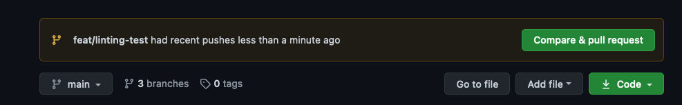
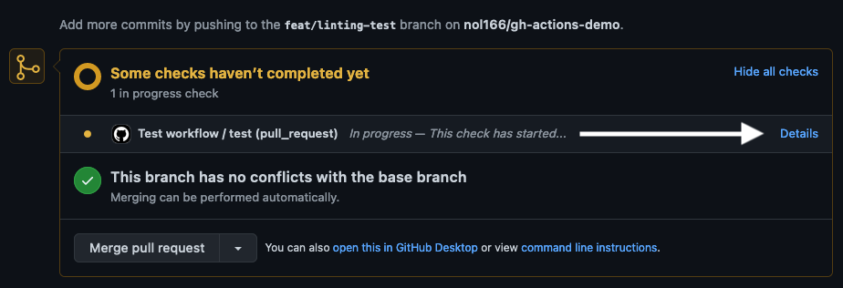
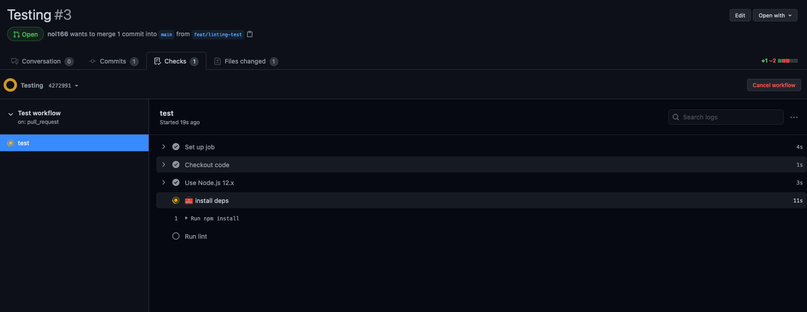
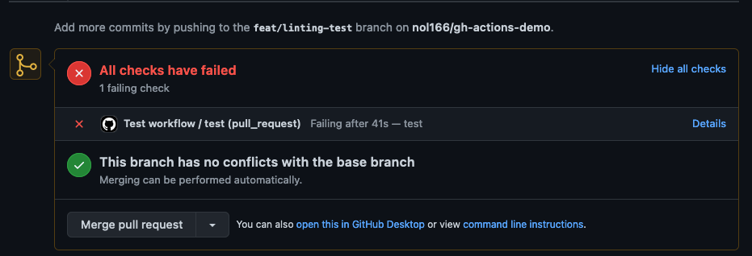

# Instructor Demo: Configuring GitHub Actions

At this point in the course, you are well aware that GitHub is a very powerful tool for collaborating with multiple users on the same project. Collaboration inevitably will cause some conflicts whether that be within the code itself or with your overall workflow. On occasion some errors will slip past a local linter and make their way into pull requests. Wouldn't it be nice to automate something like linting before each pull request?

GitHub Actions is a great solution to this problem. For example, you could create a GitHub action to automatically run a linter against every pull request to ensure the code meets your agreed upon standards. Today, we are going to create such an action.

* Before we begin, check out the [Introduction to GitHub Actions](https://docs.github.com/en/actions/learn-github-actions/introduction-to-github-actions) to get a grasp on some of the core concepts.

## Initial Project Setup

To begin, start by forking the following repository [GitHub Actions Demo](https://github.com/coding-boot-camp/github-actions-demo).  Once you have forked this repository you should then clone the forked repository to your local machine.

## Create the Workflow

Now that we have some code locally, let's create the workflow that will contain the actions we want to preform after each pull request.

1. In your terminal create a new directory called `.github`. GitHub will automatically look for this directory when it's pushed to your repository.

2. Create a `workflows` directory inside `.github`.

3. Finally, create a `main.yml` file inside your `workflows` directory

The folder structure should look something like this:

```md
.github
└── workflows
    └── main.yml
```

## Actions

Our actions will be defined inside of our `main.yml` file. To begin, let's open up `main.yml` in our code editor. YAML is a recursive acronym that stands for "YAML Ain't Markup Language". YAML is human-readable syntax for data that is being stored or transmitted.

* Note that the first part of this file simply gives a name to our workflow. The `on` portion specifies what should trigger the workflow. We also want our actions to run whenever someone creates a pull request to the `develop`, or `staging` branches.

* Next we specify the `jobs` that can run sequentially or in parallel. We are specifying that we want our job `test` to run on a container that uses Ubuntu as it's operating system. This container will be spun up by GitHub when our workflow is invoked.

* The `steps` section contains what actions or tasks we want to run on our container. In our case we are checking out the branch, using node v20, installing dependencies, and finally running our `eslint` script.

    ```yml
    # Name of workflow
    name: Lint workflow

    # Trigger workflow on all pull requests
    on:
    pull_request:
        branches:
        - develop
        - staging

    # Jobs to carry out
    jobs:
    test:
        # Operating system to run job on
        runs-on: ubuntu-latest

        # Steps in job
        steps:
        # Get code from repo
        - name: Checkout code
            uses: actions/checkout@v1

        - name: Use Node.js 21.x
            uses: actions/setup-node@v1
            with:
            node-version: 21.x

        # Install dependencies
        - name: 🧰 install deps
            run: npm install
            
        # Run lint
        - name: Run lint
            run: npm run lint
    ```

* Save the content of the snippet above to your `main.yml` file.

## Create a Pull Request

Now it's time to give our linter something to complain about! We will make some changes in any component and then create a pull request.

1. First let's make a new feature branch to create a pull request from:

    ```sh
    git checkout -b feat/linting-test
    ```

2. Add and commit your changes, then push them to our `feat/linting-test` branch

    ```sh
    git add .
    git commit -m "Creating a PR for testing"
    git push origin feat/linting-test
    ```

3. Head to GitHub and click "Create pull request" next to the yellow indicator for our recent change to `feat/linting-test`.

    

4. Click "Create pull request" and then click on "details".

    

5. In this view we can see the output of our workflow

    

6. The PR should be automatically marked as having failed checks, indicating the author needs to refactor some of the code.

    

## Conclusion

Congratulations on gaining experience with GitHub Actions! This powerful feature can become part of your CI/CD pipeline, providing valuable automation and efficiency. While you might not use it for every project, it can be especially useful for group projects or large organizations.
